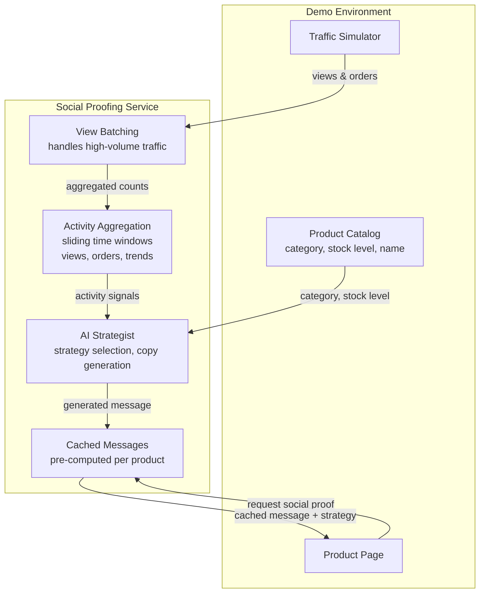
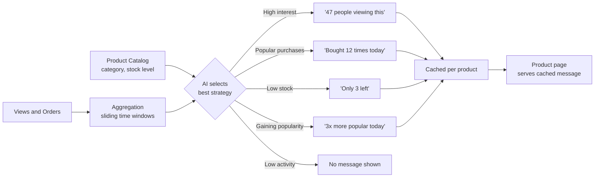

# Feature Specification: Social Proofing Agent

**Feature Branch**: `001-social-proofing-agent`
**Created**: 2026-04-10
**Status**: Draft
**Input**: Build a self-contained demo of a Social Proofing Agent for a large online retailer, replacing a legacy vendor and enhancing it with AI-powered strategy selection.

## Overview

Large online retailers typically pay external vendors to power "social proofing" features on their websites — the familiar messages like "25 people are viewing this product now" or "Bought 12 times in the last hour." These features drive significant additional revenue by creating urgency and social validation for shoppers, but vendor costs can run into millions annually while the underlying systems remain rigid and template-based with limited adaptability.

This demo builds a self-contained social proofing service that not only replicates existing functionality but enhances it with an AI agent that intelligently selects the most effective social proof strategy and generates natural, on-brand copy — rather than relying on rigid templates.

The demo showcases reliability at retail scale, intelligent context-aware messaging, and multi-region replication.

## System Overview

## How It Works

## User Scenarios & Testing

### User Story 1 - View Social Proof Message on Product Page (Priority: P1)

A customer browsing the retail website lands on a Product Detail Page (PDP) and sees a contextual social proof message that creates urgency or validates their purchase intent. The message is pre-computed by an AI agent based on real-time activity signals and cached per product, so product page requests are served instantly without triggering the AI on every view.

**Why this priority**: This is the core value proposition — the revenue-driving feature. Without this, there is no demo.

**Independent Test**: Can be fully tested by requesting a social proof message for a product with known activity signals and verifying a relevant, well-formed message is returned.

**Acceptance Scenarios**:

1. **Given** a product with 47 views in the last 30 minutes and 12 orders in the last 24 hours, **When** a customer views the product page, **Then** a social proof message is displayed that references the viewing or ordering activity
2. **Given** a product with very low activity (fewer than 3 views, 0 orders), **When** a customer views the product page, **Then** no social proof message is displayed (to avoid negative social proof)
3. **Given** a product in the "Electronics & Tech" category, **When** a social proof message is generated, **Then** the tone is professional and specification-focused
4. **Given** a product in the "Toys" category, **When** a social proof message is generated, **Then** the tone is playful and exciting

---

### User Story 2 - Ingest Product View Counts (Priority: P1)

The system receives pre-aggregated product view counts from an external source (e.g., analytics platform, CDN, or streaming pipeline) and accumulates them per product. View counting itself is out of scope — the service consumes counts produced upstream. Activity is partitioned by product, so each product's signals are tracked independently. Counters rotate on each aggregation period to enable trend comparison.

**Why this priority**: Without ingesting view data, the agent has no signals to work with. This is foundational.

**Independent Test**: Can be tested by sending view counts for a product and verifying the aggregated count is correctly maintained within the time window.

**Acceptance Scenarios**:

1. **Given** no prior activity for a product, **When** a view count of 50 is received, **Then** the product's view count within the 30-minute window is 50
2. **Given** 100 views recorded 35 minutes ago, **When** the current view count is queried, **Then** those old views are no longer included in the count

---

### User Story 3 - Ingest Order Events (Priority: P1)

The system receives order events when customers purchase products and maintains a running count. Counters rotate on each aggregation period.

**Why this priority**: Order data is a key signal for social proof ("Bought 12 times today"). Orders are lower volume than views but higher value for social proof messaging.

**Independent Test**: Can be tested by recording orders for a product and verifying the 24-hour count is accurate.

**Acceptance Scenarios**:

1. **Given** no prior orders for a product, **When** 5 orders are recorded, **Then** the 24-hour order count is 5
2. **Given** 10 orders recorded 25 hours ago, **When** the current order count is queried, **Then** those expired orders are not included

---

### User Story 4 - AI-Powered Strategy Selection (Priority: P2)

The social proofing agent analyses the combination of real-time signals (views, orders) and static product catalog data (stock level, category) to select the most effective social proof strategy before generating copy. This goes beyond rigid templates by using AI reasoning to determine what type of message will be most compelling.

**Why this priority**: This is what differentiates the solution from the legacy vendor. The legacy system uses one template; this agent reasons about which approach is most effective.

**Independent Test**: Can be tested by providing different signal combinations and verifying the agent selects the appropriate strategy type.

**Acceptance Scenarios**:

1. **Given** high views (50+) and low orders (under 5), **When** the agent generates a message, **Then** it uses an urgency or competition strategy
2. **Given** low views (under 10) and high orders (15+), **When** the agent generates a message, **Then** it uses a validation or trust strategy
3. **Given** low stock (under 5) and high demand, **When** the agent generates a message, **Then** it uses a scarcity strategy
4. **Given** view count 3x higher than the previous equivalent period, **When** the agent generates a message, **Then** it uses a trending strategy

---

### User Story 5 - Simulated Event Generator for Demo (Priority: P2)

A built-in event generator produces realistic synthetic product view and order events across a catalog of demo products. This allows the demo to run self-contained without any external data dependencies.

**Why this priority**: The demo must be self-contained. Without synthetic data, there is nothing to demonstrate.

**Independent Test**: Can be tested by starting the generator and verifying that events are produced at realistic rates across the demo product catalog.

**Acceptance Scenarios**:

1. **Given** the demo is started, **When** the event generator runs, **Then** it produces view and order events for at least 10 demo products across categories (electronics, furniture, toys)
2. **Given** the generator is running, **When** 1 minute has elapsed, **Then** products show varying levels of activity (some hot, some cold) to demonstrate different strategy selections
3. **Given** a hot product in the demo catalog, **When** its social proof is queried, **Then** the message reflects high activity

---

### User Story 6 - Demo Web UI (Priority: P3)

A simple web interface displays a grid of demo products with their live social proof messages, updating periodically. This provides a visual showcase for stakeholder presentations.

**Why this priority**: Enhances the demo experience but the core functionality works without it (can demo via API calls).

**Independent Test**: Can be tested by opening the UI in a browser and verifying products display with social proof messages that update over time.

**Acceptance Scenarios**:

1. **Given** the service is running with the event generator active, **When** a user opens the demo UI, **Then** they see a grid of products with social proof messages
2. **Given** the UI is open, **When** 10 seconds pass, **Then** the social proof messages refresh to reflect updated activity

---

### User Story 7 - Multi-Region Deployment (Priority: P2)

The service is deployed across multiple regions with replication, so social proof signals from one region are visible in all others. The service remains available even if a region goes down.

**Why this priority**: A product trending in one region should show that activity globally. Multi-region also ensures availability during regional outages.

**Independent Test**: Can be tested by deploying to two regions, generating activity in one region, and verifying the signals are visible when querying from the other region.

**Acceptance Scenarios**:

1. **Given** the service is deployed to two or more regions, **When** view and order events are recorded in region A, **Then** those signals are reflected in social proof messages served from region B
2. **Given** the service is running in multiple regions, **When** one region becomes unavailable, **Then** the other regions continue serving social proof messages without interruption

---

### Edge Cases

- What happens when a product has zero activity across all signals? No social proof message is returned
- What happens when view counts are extremely high (e.g., viral product with 100,000+ views)? The agent handles large numbers gracefully (e.g., "Thousands are viewing this right now" rather than exact large numbers)
- What happens when the batch buffer has not flushed yet? The system returns the last known aggregated count, which may be up to one batch window old (acceptable for social proof)

## Requirements

### Functional Requirements

- **FR-001**: System MUST track pre-aggregated product view counts with periodic counter rotation for trend comparison (view counting itself is out of scope)
- **FR-002**: System MUST count product order events with periodic counter rotation
- **FR-003**: System MUST accept pre-aggregated view counts from external sources via ingestion endpoint
- **FR-004**: System MUST expose an HTTP endpoint that returns a pre-computed, cached social proof message for a given product ID
- **FR-005**: System MUST use an AI agent to select the most effective social proof strategy based on the combination of: view count, order count, stock level, and product category
- **FR-006**: System MUST use an AI agent to generate natural, on-brand copy that adapts tone by product category
- **FR-007**: System MUST suppress social proof messages when activity signals are below minimum thresholds (configurable, default: fewer than 3 views and 0 orders)
- **FR-008**: System MUST include a built-in synthetic event generator that produces realistic traffic patterns across a demo product catalog of at least 10 products spanning 3 or more categories
- **FR-009**: System MUST return cached social proof responses with low latency (no LLM call on read path)
- **FR-010**: System MUST periodically regenerate social proof messages as activity signals change
- **FR-011**: System MUST track trend direction by comparing current window activity to the previous equivalent period

### Throughput Requirements

- **TR-001**: System MUST handle sustained ingestion of pre-aggregated view counts and order events
- **TR-002**: System MUST handle peak ingestion bursts via entity-level partitioning by product ID
- **TR-003**: System MUST serve social proof read requests at 200-700 requests per second under normal load
- **TR-004**: System MUST serve social proof read requests at up to 7,000 requests per second under peak load
- **TR-005**: For the demo, the synthetic event generator MUST produce events at a configurable rate, defaulting to approximately 10 events per second across all products

### Key Entities

- **Product**: Represents a single product in the retail catalog. Tracks aggregated view counts (30-min window), order counts (24-hr window), stock level, product category, and trend direction. Identified by product ID.
- **Social Proof Message**: The output of the agent — contains the generated message text, the strategy used (urgency, validation, scarcity, or trending), and a confidence indicator.
- **Demo Product Catalog**: A fixed set of demo products with predefined categories, names, stock levels, and base prices. Used by the event generator to simulate realistic traffic.

## Success Criteria

### Measurable Outcomes

- **SC-001**: Social proof messages are returned from cache with low latency (no LLM dependency on the read path)
- **SC-002**: The system correctly selects different social proof strategies for different signal combinations (at least 4 distinct strategies demonstrated during the demo)
- **SC-003**: No social proof message is shown for products with activity below the suppression threshold
- **SC-004**: The system handles simulated traffic without data loss or degraded response times
- **SC-005**: The demo runs fully self-contained with no external data dependencies — start the service and it works
- **SC-006**: The system demonstrates at least 3 different product categories with category-appropriate tone in the generated copy
- **SC-007**: The batching mechanism significantly reduces write volume compared to writing every individual view event
- **SC-008**: When deployed to multiple regions, social proof signals replicate across regions and the service remains available if a region goes down

## Assumptions

- **View counting is out of scope** — the service receives pre-aggregated view counts from an external source (analytics platform, CDN, streaming pipeline). Order counting is in scope — the service tracks individual orders within a 24-hour window.
- The demo uses a fixed catalog of 10-15 products across Electronics & Tech, Home & Garden, and Toys categories. No real product data is needed.
- Stock levels are simulated (hardcoded or randomised per product) — no integration with a real inventory system.
- An LLM provider is available and configured via environment variable. The demo is model-agnostic and not designed to work offline.
- The 30-minute view window and 24-hour order window are reasonable defaults for social proof relevance. These are configurable.
- Social proof messages showing slightly stale data (seconds, not minutes) is acceptable given the batching trade-off.
- The demo supports multi-region deployment with replication. Single-region works for development; multi-region is optional but recommended for the full demo.
- Authentication and authorization are out of scope for the demo endpoint (open access).
- The trend comparison (current vs previous period) uses a simple ratio of the same-length window immediately prior (e.g., last 30 min vs 30-60 min ago for views).
