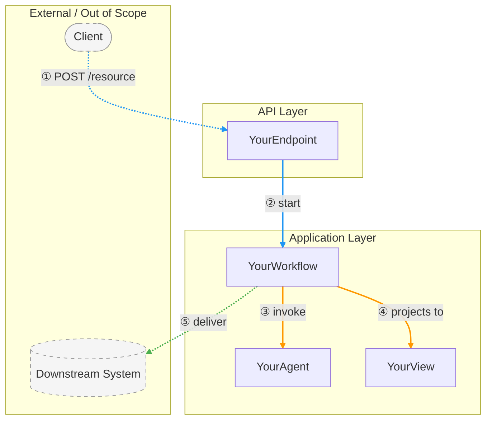
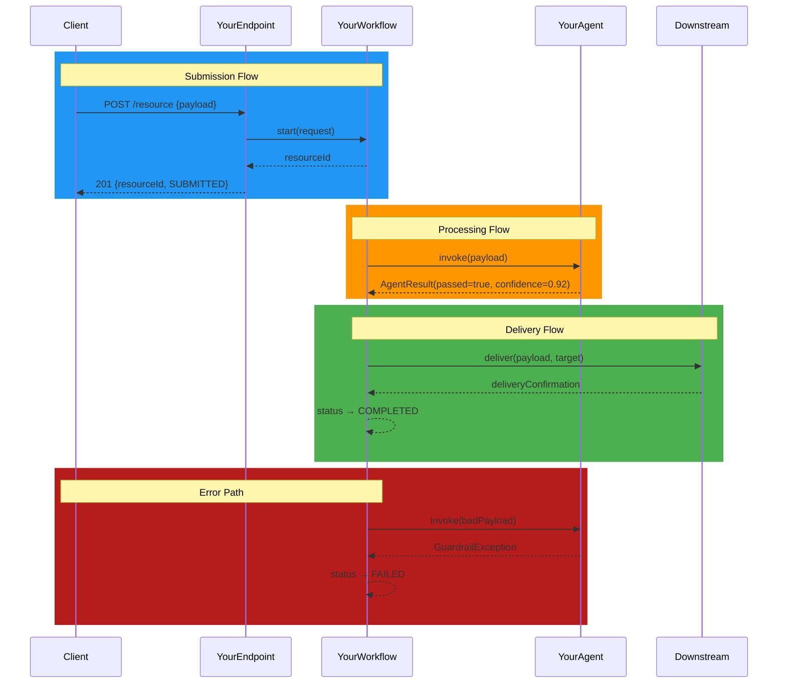
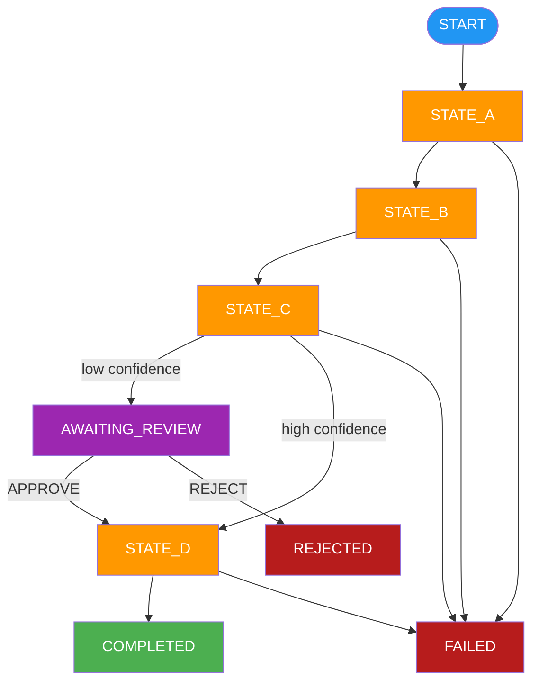

# Diagrams: [FEATURE]

**Feature**: [FEATURE] | **Plan**: [link to plan.md]

## Color Conventions

Use only the colors whose flow types exist in this feature. Do not invent
flow categories to justify using a color.

| Flow Type | Color | Hex |
|-----------|-------|-----|
| Submission / happy-path | blue | `#2196F3` |
| Validation / processing | amber | `#FF9800` |
| Safety / blocking / rejection | red | `#F44336` |
| Human-review / approval (HITL) | purple | `#9C27B0` |
| Routing / delivery / success | green | `#4CAF50` |
| Error / failure | crimson | `#B71C1C` |

## External / Out-of-Scope Systems

- Wrap external actors and systems in a subgraph labelled "External" or "Out of Scope"
- Style every external node with a dashed border:
    `style NodeId stroke-dasharray:5 5,stroke:#999,fill:#f5f5f5,color:#333`
- Use dotted arrows (`-.->`) for ALL connections to/from external nodes
- Do NOT use dotted arrows for internal indirect connections — use a comment instead
  (this disambiguates "external" from "event-driven internal")

## Message Broker / Topic Nodes

Mandatory when `@Produce.ToTopic` or `@Consume.FromTopic` is used:

- Represent every topic as an explicit named node — NEVER collapse topic into an arrow label
- Flowchart shape: cylinder → `TOPIC_ID[(topic-name)]`
- Flowchart grouping: place in a subgraph labelled "Message Broker" or "Topics"
- Flowchart style: `fill:#FFF9C4,stroke:#F9A825,color:#333`
- Producer edge: solid arrow `-->` labelled "publish"
- Consumer edge: solid arrow `-->` labelled "subscribe"
- Sequence diagram: declare as participant, e.g. `participant T as validated-content`
  - Producer sends: `->> T: publish(Payload)`
  - Consumer reads: `T -->> Consumer: message`

## Sequence Numbers

Add ①②③… on flowchart edge labels to show execution order.
Use `linkStyle N stroke:#RRGGBB,stroke-width:2px` to color edges by flow.
`linkStyle` indices are 0-based and match the order edges are declared in the diagram.

---

## 1. Component Dependencies

<!--
  Flowchart showing every component and how they depend on / call each other.
  - One node per class/component (use short names)
  - Group by package with subgraph blocks
  - Color edges by flow type (see Color Conventions above)
  - Sequence numbers ①②… on connections show runtime call order
  - External / out-of-scope: dashed border node + dotted arrow (-.->)
  - Internal indirect / event-driven: solid arrow with an italic comment label
-->

---

## 2. Sequence Diagram

<!--
  End-to-end sequence diagram showing the primary flows.
  - Use `rect rgb(R,G,B)` blocks to color each flow section.
  - Match colors to Color Conventions above.
  - Include at least: happy path, HITL / review flow (if applicable), and one error path.
  - Label participants with short role names.
  - Valid arrow types: ->> (solid), -->> (dotted async), -> (solid open), --> (dotted open)
  - Do NOT use -.>> — it is invalid in Mermaid sequence diagrams. Use -->> for dotted arrows.
-->

---

## 3. Workflow State Machines

<!--
  INCLUDE ONLY if the feature uses one or more Akka Workflows.
  Remove this section entirely if no Workflow is used.

  REPEAT the subsection below once per Workflow class — one state machine per workflow.
  Title each subsection with the workflow class name: "### 3.N WorkflowClassName"

  Per diagram:
  - Show every status value as a node.
  - Color nodes by flow category (see Color Conventions above):
      Entry / initial state   → blue
      Processing states       → amber
      HITL / review states    → purple
      Terminal success        → green
      Terminal failure        → red/crimson
  - Label transitions with the trigger (step name or command).
  - Use ([text]) for start/end nodes, [text] for intermediate states.
-->

### 3.1 YourWorkflow

