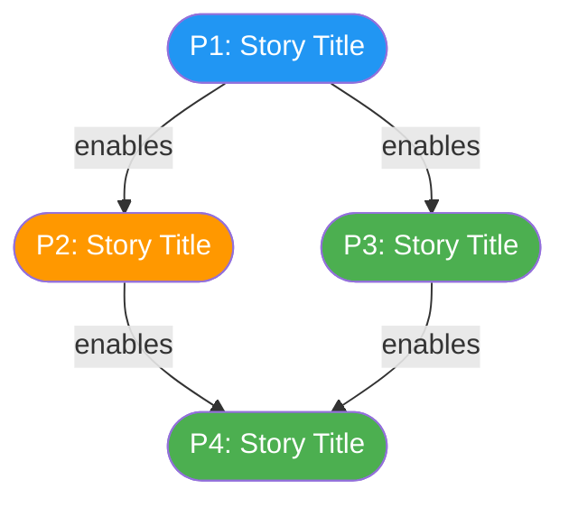
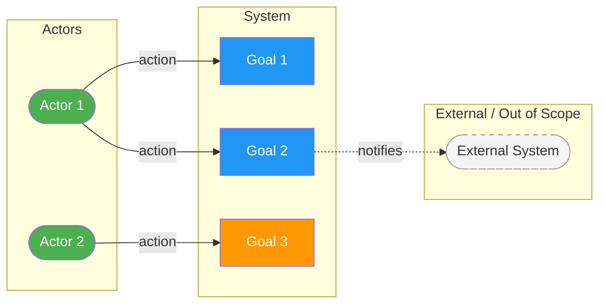
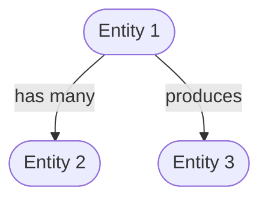
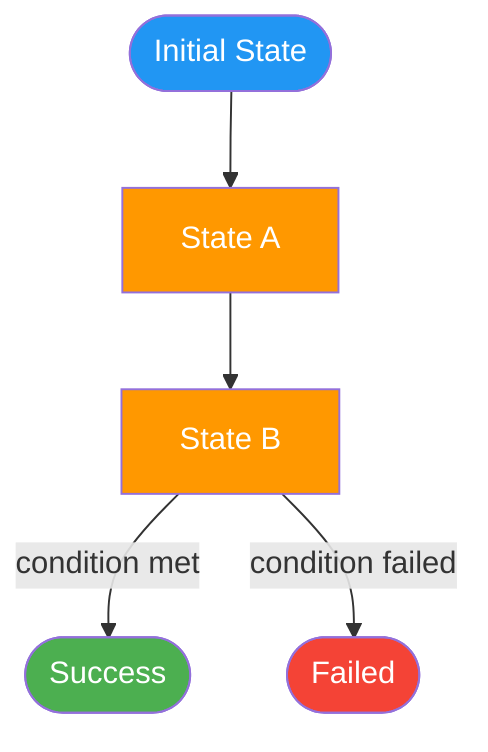

# Spec Diagrams: [FEATURE]

**Feature**: [FEATURE] | **Spec**: [link to spec.md]

## Color Conventions

Use only the colors whose categories exist in this feature. Do not invent
categories to justify using a color.

| Category | Color | Hex |
|----------|-------|-----|
| Primary / P1 stories | blue | `#2196F3` |
| Secondary / P2 stories | amber | `#FF9800` |
| Tertiary / P3+ stories | green | `#4CAF50` |
| Human actor | green | `#4CAF50` |
| External / out-of-scope system | grey dashed | `#f5f5f5` + `stroke-dasharray:5 5,stroke:#999` |
| Terminal / failure state | red | `#F44336` |
| Error / failure state | crimson | `#B71C1C` |
| Review / decision point | purple | `#9C27B0` |

## External / Out-of-Scope Systems

- Wrap external actors and systems in a subgraph labelled "External" or "Out of Scope"
- Style every external node with a dashed border:
    `style NodeId stroke-dasharray:5 5,stroke:#999,fill:#f5f5f5,color:#333`
- Use dotted arrows (`-.->`) for ALL connections to/from external nodes

---

## 1. User Journey Map

<!--
  A flowchart showing the user stories as a journey.
  - Each user story is a node, labelled with its short title
  - Arrange top-to-bottom by priority (P1 at top)
  - Show dependencies between stories with arrows (e.g., P3 depends on P1 and P2)
  - Color nodes by priority tier
  - Use rounded boxes for stories: ([Story Title])
  - Add brief edge labels showing why the dependency exists
  - This is NOT a technical diagram — focus on user value and story relationships
-->

---

## 2. Actor–Goal Overview

<!--
  A flowchart showing who interacts with the system and what they want to achieve.
  - Identify actors from the user stories (submitter, reviewer, admin, etc.)
  - Show the system as a central node
  - Connect actors to their goals (derived from user stories)
  - Use rounded boxes for actors: ([Actor Name])
  - Use rectangles for goals: [Goal]
  - Use dashed borders for external/out-of-scope systems
  - This is a use-case-level view — no implementation details
-->

---

## 3. Entity Relationship Map

<!--
  INCLUDE ONLY if the spec defines Key Entities.
  Remove this section entirely if no entities are described.

  A diagram showing the key entities and their relationships.
  - One node per entity from the Key Entities section
  - Show relationships and cardinality where described
  - Use simple labels (has, belongs to, produces, triggers)
  - Do NOT include database columns or types — keep it conceptual
  - Use stadium-shaped nodes for entities: ([Entity Name])
-->

---

## 4. Status Lifecycle

<!--
  INCLUDE ONLY if the spec describes a status lifecycle or state progression.
  Remove this section entirely if no lifecycle is described.

  A state diagram showing how the primary entity progresses through statuses.
  - Use the statuses exactly as named in the spec
  - Color terminal success states green, terminal failure states red
  - Color intermediate states amber
  - Color decision/review states purple
  - Label transitions with the trigger (what causes the transition)
  - Use ([text]) for start/end nodes, [text] for intermediate states
-->

